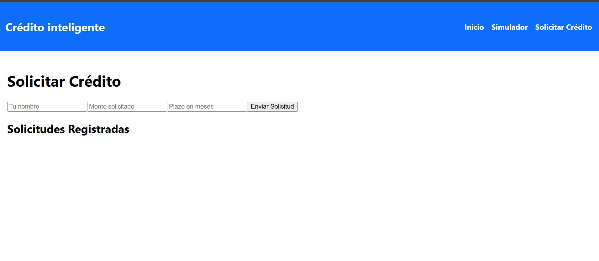

CreditSmart – Simulador de Créditos con Firebase

Autor: Juan Martín Estrella Muñoz
Curso: Ingeniería Web
Tecnologías principales: React (Create React App), Firebase Firestore, React Router, Hooks, JavaScript ES6+, CSS.

Descripción del Proyecto

CreditSmart es una aplicación web desarrollada en React que funciona como un simulador y gestor de solicitudes de crédito, integrando Firebase Firestore como base de datos NoSQL en la nube.

La aplicación permite crear, consultar, actualizar y eliminar solicitudes de crédito (CRUD completo), garantizando persistencia de datos, comunicación asíncrona y almacenamiento seguro en la nube.

Los datos persisten entre sesiones, incluso al cerrar el navegador o recargar la página.

 Funcionalidades Principales

Crear solicitudes de crédito

Consultar solicitudes almacenadas en Firestore

Actualizar solicitudes existentes

Eliminar solicitudes

Persistencia de datos en la nube

Comunicación asíncrona con Firebase

Mensaje de carga (loading)

Manejo de errores (por ejemplo, al desconectar internet)

Navegación entre vistas con React Router

🛠️ Tecnologías Utilizadas

React (Create React App)

Firebase

Cloud Firestore (NoSQL)

React Router

JavaScript ES6+

React Hooks (useState, useEffect)

CSS

Git & GitHub

 Estructura del Proyecto
src/
 ├── components/
 ├── pages/
 │    └── SolicitarCredito.jsx
 ├── data/
 │    └── creditsData.js
 ├── firebaseConfig.js
 ├── App.js
 ├── index.js
public/
 └── screenshots/
      ├── captura1.png
      ├── captura2.png
      └── captura3.png
.gitignore
.env.example
package.json
README.md

⚙️ Instalación y Ejecución
1️⃣ Clonar el repositorio
git clone https://github.com/JM10ban/creditos-react
cd creditos-react

2️⃣ Instalar dependencias
npm install

3️⃣ Configurar variables de entorno

Crear un archivo .env basado en .env.example

Agregar las credenciales de Firebase

NO subir el archivo .env al repositorio

4️⃣ Ejecutar la aplicación
npm start

La aplicación se abrirá en:
 http://localhost:3000

 Firebase y Firestore

Se utiliza Cloud Firestore como base de datos NoSQL para almacenar las solicitudes de crédito.

Operaciones CRUD implementadas:

Create: addDoc()

Read: getDocs()

Update: updateDoc()

Delete: deleteDoc()

Los datos pueden verificarse desde Firebase Console, en la colección solicitudes.

 Seguridad

El archivo .env está protegido mediante .gitignore

Se incluye .env.example como referencia

 Capturas de Pantalla

### 🏠 Pantalla principal

### 📄 Formulario de solicitud

### 📊 Resultado de simulación

 Archivo de Datos

Archivo de ejemplo para datos locales:

src/data/creditsData.js

Ejemplo:

export const creditsData = [
  {
    id: 1,
    nombre: "Crédito Libre Inversión",
    tasa: 1.2,
    descripcion: "Crédito diseñado para cubrir necesidades personales."
  }
];

Video Demostrativo

El proyecto incluye un video demostrativo (3–4 minutos) donde se evidencia:

Funcionamiento general de la aplicación

Creación de solicitudes

Persistencia de datos en Firebase

Actualización y eliminación de registros

Verificación directa en Firebase Console

Manejo de errores y estado de carga

 Conclusión

Este proyecto demuestra la correcta integración de React con Firebase Firestore, aplicando conceptos de persistencia de datos, bases de datos NoSQL, CRUD completo, seguridad y comunicación asíncrona, cumpliendo con los objetivos académicos del curso.